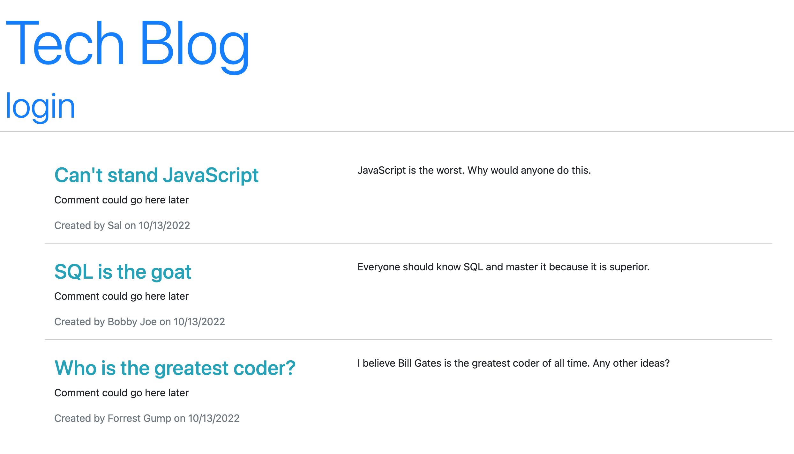

# Title: Tech Blog Challenge 

## Table of Contents

* [Description](#description)

* [Contributing](#contributing)

* [License](#license)

* [Questions](#questions)

* [Media](#media)

## Description

When a user visits the site, they are initially presented with the home page, which lists all existing blog posts, along with navigation links for the homepage and the option to log in. The homepage link goes to the home page. The Sign In link takes the user to the sign in page where they either sign in or sign up. The user can sign up and enter a username and password, or, if the user already has signed up they can enter their credentials to log in. When the user is signed in, they see the option to go to the home page or logout - and if they go to the homepage they can go to their profile page - which they start at. The homepage has all of the posts along with the user's posts and when they were created and by who. The user can go to their profile page where they can add a new post and view their posts. When a user clicks on the title of a post, they are directed to a page that just has that post on it. If the user clicks the logout button, they are logged out and taken back to the home page. 

## Contributing

Jack Warrick

## Tests

## License

This application is covered under the MIT License.

## Questions

For more information, please reference my GitHub profile [here](https://github.com/JackWarrick), or reach out to my email: j.d.warrick@comcast.net.

## Media

**Link to deployed application:**

[Link to Deployed Application]()

-----

**Screenshot of answered prompts:**

